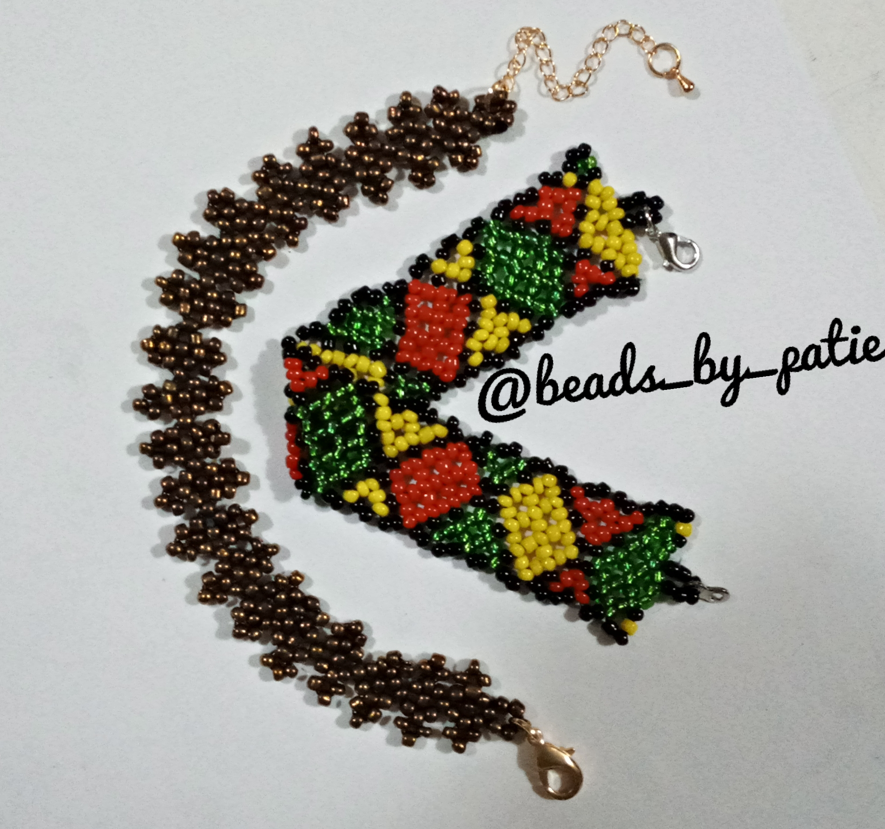
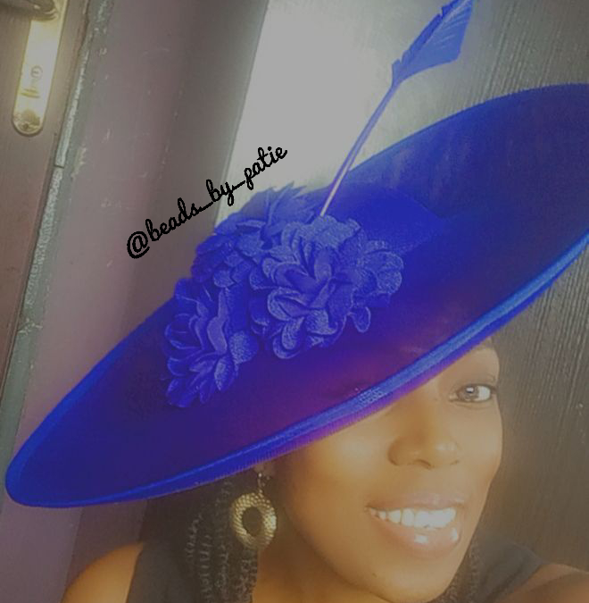
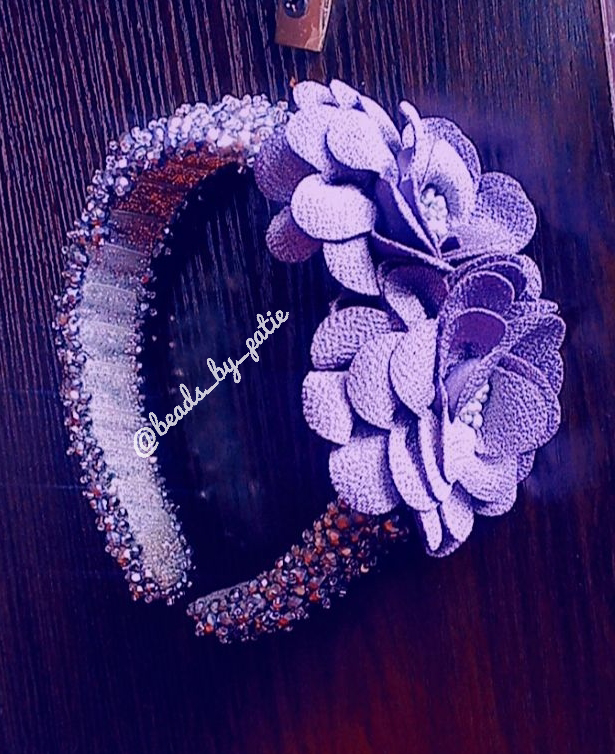

I am **Ogoh, Patience Onyechi**,

A graduate of Physics, with a Masters in Applied Geophysics.

currently, I work as a physics teacher. I intend however to switch fields into Geophysics. 
I find it interesting that geophysics has areas related to tech and AI, and I seek to learn this fusion of both fields.

When I am not all soaked in Physics and coding, I try my hands on my craft; Bead making.

I make things like;
- Bracelets,
- Anklets,
- Earrings and Necklaces,
- Fascinators,
- Headbands,
- Bags
- And all things bead.

### Bracelets

--- 

### Anklets

---

### Necklace and Ear rings

---
### Fascinators

---
### Headbands

---
### Bags

---
I will love to see how far I can go in coding, and exploring all avenues open to me.